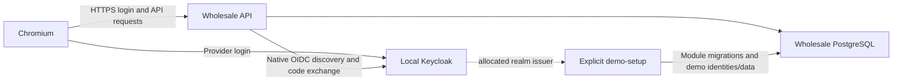

# E3.7 Real OIDC and protected browser journey

Status: owner-reviewed and checkpointed as `dc3ac3b` after E3.6 checkpoint `28ee797`.
[The report](../reports/e3-7-oidc-browser-journey.md) records actual verification and remaining
limits. The checkpoint's repository hooks passed.

## Outcome

Run the existing Wholesale API against a disposable local Keycloak realm and prove native
authorization-code login/callback, application actor mapping, Organization admission and
one protected Sales profile edit in an actual Chromium browser. Use the existing API and
module Contracts; a product frontend is not needed to exercise this capability.

E3.6 proved explicit runtime setup, health and telemetry. Its 314 passing cases and manual
dashboard observations remain checkpoint evidence; they did not establish real OIDC or
browser cookie behavior. Archived login tests used HttpClient, parsed forms and special
cookie handling. Transfer their intent without transferring those test workarounds.

## Resource graph and ownership

Extend the current AppHost with an opt-in local Keycloak resource. Keep external OIDC
configuration available when that resource is omitted; the existing public runtime test
should still start without an identity provider. Selection is AppHost construction-time
configuration, not a runtime authentication strategy switch or library options hierarchy.
Consumer key: `LocalDevelopment:UseLocalIdentityProvider`, default false.

Use native `Aspire.Hosting.Keycloak`, realm import and endpoint references. Retain hosting
13.5.4 and the pinned integration `13.5.3-preview.1.26425.3`, whose preview status is explicit.
Pinned API/source inspection and actual runtime login verified native certificate handling
and realm import against Keycloak 26.8.0. Current integration search returns newer 13.6
previews and does not authorize upgrading the graph. No Keycloak-specific
authentication package is required in the API: keep native `AddOpenIdConnect`.

The local realm is new sample-owned configuration, with a confidential code-flow/PKCE client,
two mapped demonstration accounts and one deliberately unmapped account. Disable public
registration and direct password grants for this proof. Pass admin, client and demonstration
passwords as explicit secret parameters/environment values. Realm JSON contains placeholders,
not committed credentials. No provider admin logic runs during application requests.

Use HTTPS for the API and provider, native development certificate support and native OIDC
metadata/token validation. Verify the concrete HTTPS authority even if a native endpoint's
name is `http`; do not infer its scheme from its name. Avoid replacing discovery/token
validation with a fake provider or disabling backchannel certificate validation. Browser
test contexts may explicitly ignore local development certificate trust errors; report that
limit without claiming browser CA trust or production TLS compatibility.

Supply the exact allocated API HTTPS `/signin-oidc` URI to realm import through a native
endpoint expression in `KnownNetworkIdentifiers.LocalhostNetwork` and a Keycloak environment
placeholder. The browser callback requires that explicit network context: a default expression
inside a container translates its hostname to `aspire.dev.internal`, which the real login
rejected. The corrected localhost expression works before resource start without a circular
startup dependency. No wildcard callback or provider admin worker is needed.

Keep Keycloak storage ephemeral in this first local-provider recipe, so realm/client imports
reflect the current callback on each run. Use a configurable stable provider port for normal
local use: Access persists the exact issuer, which includes the port. Tests use randomized
ports with a fresh database/browser context. Document that changing the authority requires
explicit account mapping in a retained database; startup never rewrites existing identities.
Durable provider administration and upgrades remain separate work.

## Explicit application identity setup

The current finite setup seeds fictional issuer/subject pairs. Add consumer-owned setup
inputs for the real realm issuer and known imported account subjects. The AppHost passes
them to `demo-setup`; the setup registers those exact external identities against the
existing `application-alpha`/`application-beta` users. Imported account IDs must be stable
and their actual token subjects verified. Standalone/checkpoint-fixture setup retains its
current defaults when local-provider inputs are absent. Partial/invalid explicit inputs
fail before applying demo data rather than silently falling back.

Alpha keeps membership in both Organizations; Beta belongs only to South. The third
provider account has no Access mapping, even if its email matches a mapped account.
No email linking, automatic user creation, invitation acceptance or membership provisioning
is added. An unmapped, natively authenticated principal remains an application mapping
failure (403), including on otherwise anonymous application endpoints.

Migrations and demo data remain explicitly started through the existing finite command.
Provider realm bootstrap is local infrastructure setup, distinct from application schema
and identity setup. There is no automatic API startup migration/seed or cross-module atomic
setup guarantee. Setup still rejects populated demo data rather than reconciling it.

## Native challenge behavior gap

Preparation found a composition mismatch: `NativeAuthentication` currently defaults challenges
to OIDC, while the HTTP test fixture replaces the default challenge with cookies. The 401
cases therefore prove the cookie path, not the executable host's default challenge behavior.
Do not carry that test-only override into the real browser journey.

Align the consumer registration with native .NET 10 cookie API behavior: cookies handle
default authentication/challenge/forbid, and `/login` explicitly challenges the named OIDC
scheme as it already does. Keep `.RequireAuthorization()` and native API metadata effective.
Anonymous JSON profile/antiforgery requests must receive 401 without a provider redirect;
`/login` must redirect through the real provider. No custom challenge middleware, actor
authorization extension or framework-specific status handler is needed. Remove the fixture
challenge override once production registration has this behavior and rerun its existing cases.
The browser run additionally required native typed results on profile and antiforgery GETs:
an untyped `IResult` return does not declare their JSON API metadata during endpoint creation.
Use `TypedResults`/a typed result union so these anonymous fetches receive 401 without adding
XHR headers or replacing cookie challenge events.

## Browser proofs

Add focused tests to the runtime suite using test-only `Microsoft.Playwright` and its matching
Chromium installation. Use separate fresh browser contexts for distinct login identities;
let the browser navigate the real provider form and native callback and retain its cookies.
Call same-origin API endpoints with browser `fetch`, so cookie and antiforgery behavior is
actual browser behavior. Do not inject protected cookies, manually replay OIDC form posts,
grant tokens through password flow or alter cookie flags to make the test pass.

Three bounded journeys are sufficient initially:

1. **Mapped Alpha login and mutation.** Anonymous catalog remains usable and protected JSON
   requests return native 401 without redirecting. `/login` reaches
   Keycloak and returns through `/signin-oidc` to `/identity`, exposing human actor
   `application-alpha`. Follow-up browser requests use the native session cookie. Both
   Organization identities select the same actor with distinct tenant IDs. Read the Alpha
   profile, prove PUT without antiforgery returns 400 and leaves it unchanged, acquire the
   native `/antiforgery` cookie/token pair and submit a valid edit. Observe committed text
   and advanced version through a later GET; Beta's profile remains unchanged. Reusing the
   old expected version yields 409 with no additional write. Cookie inspection may assert
   the sample's declared Secure/HttpOnly/SameSite settings without testing cryptography.
2. **Mapped Beta admission.** Login in a separate browser context resolves
   `application-beta`. South is admitted, North is rejected before business work. Use a
   controlled unavailable Sales table after an initial successful read to make ordering
   observable: denied North still returns 404 rather than a database fault. A fixture
   SQL membership suspension then rejects the next South operation with the same login
   cookie, proving that authority is looked up afresh rather than carried in the session.
   This SQL is fault/setup control, not a new membership administration endpoint.
3. **Unmapped provider account.** Complete real provider login for an account whose subject
   has no Access link. Application requests return mapping failure 403, including public
   identity/catalog requests; matching email grants no link and no Access rows appear.

Use independently expected actor/tenant IDs and read-after-write outcomes, not assertions
over registration descriptors or Keycloak's implementation. Keep existing HTTP/PostgreSQL
cases for detailed token rebinding, constraints, races and cancellation; do not duplicate
their entire matrices in slow browser tests. The real login path retains the explicit challenge.

## Implementation and validation

One reviewable slice covers AppHost/realm wiring, explicit setup inputs, browser journeys
and their documentation/CI. No technical library interface change is assumed. Likely review
files are AppHost Program and realm JSON, native authentication registration, finite setup/Access demo seed, runtime browser tests,
test-only package pins and local run instructions. Each journey owns disposable graph/data
or explicitly isolated fixtures; test order must not determine admission or profile versions.
The sample adds `DemoAccessIdentities(ExternalIdentity Alpha, ExternalIdentity Beta)` and
optional identity inputs to `AccessDemoSeed.Stage` and `DemoSetup.InitializeAsync`; existing
calls retain their fictional defaults. `DemoIdentitySetup.Read` consumes the three finite
command configuration keys before migrations. These are editable sample APIs, not technical
library interfaces. Partial inputs, an insecure issuer or duplicate subjects reject setup
before schema/data writes; ordinary HTTP requests never call setup.

Keep container-free core/adapter adoption independent. Install the matching Chromium binary
and its system dependencies only in the runtime lane; do not add Node/pnpm tooling or a
frontend workspace solely for a .NET browser test. Keep browser/container tests outside
commit hooks. Bound graph startup and browser actions and dispose graph/browser contexts
through native APIs. Never require an already-running provider or personal credentials.

Validate the existing public runtime proof, new browser journeys, affected setup/HTTP tests,
architecture/independent adoption, solution/style/analyzers/formatter, archive integrity and
local links. Also start the graph through native Aspire CLI, discover endpoints, explicitly
start setup and verify the documented local login path. Report automated results separately
from manual observations and historical E3.6/archive evidence.

## Library, template and sample findings

The owner confirmed that native ServiceDefaults supplies the useful defaults; its editable
source belongs in the template and warrants no Foundry library wrapper. E3.7 similarly starts
as a sample/template authentication recipe. Its proof may identify a focused utility, but
one Keycloak provider does not justify a provider-neutral authentication framework.
ActorIdentity, Tenancy and EF ownership remain separate opt-in segments.

Template material gains optional local-provider wiring, realm configuration, explicit
external-account setup and an exercised native browser login/mutation recipe. Materialized
template output/bootstrap CLI remain E10. The optional human-actor antiforgery requirement
remains a later reuse candidate; this slice does not extract the current HTTP token wiring.

Successful journeys close the bounded E3 state-stored ingress proof, then work returns to E4
durable event identity/payload codecs. They do not establish production provider compatibility,
proxy/subdomain topology, logout/provider end-session, ticket-store/session invalidation,
account lifecycle, membership administration, roles/permissions or open registration.

## Preparation evidence and implementation follow-through

The active `NativeAuthentication`, `DemoSetup`, `AccessDemoSeed` and runtime case establish
the current native flow and setup obligations. Archive source is historical reference only.
The local pinned Keycloak XML metadata exposes native realm import; the active hosting XML
exposes development certificate utilities. Those were preparation evidence; actual pinned
source inspection, native CLI observations and automated tests are recorded separately in
[the implementation report](../reports/e3-7-oidc-browser-journey.md). No archived browser result
is claimed as a fresh E3.7 proof.

The [native Keycloak integration](https://aspire.dev/integrations/security/keycloak/) documents
local hosting and realm import, whose deployment support must be checked by version.
[Keycloak realm import](https://www.keycloak.org/server/importExport) supports environment
placeholders and skips existing realms at startup, motivating ephemeral provider data and
explicit retained-database identity ownership. [Keycloak TLS](https://www.keycloak.org/server/enabletls)
documents provider certificate configuration. [Playwright .NET browsers](https://playwright.dev/dotnet/docs/browsers)
requires a browser binary matching the selected package; pin it when adding the test dependency.
These current documents guide implementation but do not substitute for pinned API/runtime proofs.
The [native .NET 10 cookie API behavior](https://learn.microsoft.com/en-us/dotnet/core/compatibility/aspnet-core/10/cookie-authentication-api-endpoints)
supports 401/403 for recognized API endpoints when the cookie handler performs the challenge;
it does not change an explicitly selected OIDC challenge handler into a cookie challenge.
