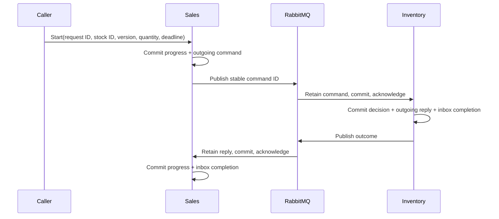

# Durable stock-issue workflow

WF1 demonstrates Sales-owned progress across an independently committed Inventory command.
The modules communicate through their versioned Contracts using the existing Rootbolt
inbox/outbox. The executable owns transport and hosting; there is no saga engine.

Sales persists a request and one outgoing command together. Inventory processes that command
in its own transaction, appending stock facts, updating its inline aggregate, recording its
accepted-change audit and queuing a reply. Sales processes the reply in another transaction,
saving progress with inbox completion. There is no transaction spanning both modules.



## Run the executable

Use .NET from `global.json`, PostgreSQL and RabbitMQ. Configure
`ConnectionStrings__Sales`, `ConnectionStrings__Inventory` and `ConnectionStrings__RabbitMq`
in your environment. Separate databases demonstrate that private persistence is not shared.
`QueuePrefix` selects a deployment's physical queue namespace; the default is `wf1`.
For this finite sample, `Organization` is `wholesale-alpha` (default) or `wholesale-beta`.

Run from the repository root:

```sh
dotnet run --project samples/Wholesale/WorkflowDemo -- --role setup
dotnet run --project samples/Wholesale/WorkflowDemo -- --role seed --StockId 8c6e282e-d9ec-455a-8fab-d114c176a7cd
dotnet run --project samples/Wholesale/WorkflowDemo -- --role run
```

Setup applies each module's own migrations and creates two durable queues. Seed explicitly
opens a new stock position and receives quantity 5, producing version 2. It is a demonstration
seed for a fresh identity, not an idempotent provisioning API. `run` validates existing storage
and queues, then hosts the provided outbox and inbox workers for each module, native intake,
and a small Sales deadline poller. Startup never migrates, seeds or creates queues.

In another terminal, submit a request with a deadline of your choosing, then read it:

```sh
dotnet run --project samples/Wholesale/WorkflowDemo -- --role start --RequestId 384dd028-a593-434d-a625-501c490adff8 --StockId 8c6e282e-d9ec-455a-8fab-d114c176a7cd --ExpectedVersion 2 --Quantity 1 --ReplyDeadline 2030-01-01T00:00:00Z
dotnet run --project samples/Wholesale/WorkflowDemo -- --role read --RequestId 384dd028-a593-434d-a625-501c490adff8
```

The expected outcome is Issued, recorded stock version 3 and remaining quantity 4. Identical
start retries return the same persisted command identity, even after resolution. Changed inputs
under the same request identity fail. A competing start can raise a native unique-key failure;
retry the identical operation in a fresh scope to observe the winner. Retain the original
request ID and inputs after an ambiguous commit response.

Programmatic consumer usage is direct:

```csharp
var progress = await requests.StartAsync(
    new StartStockIssueRequest(requestId, stockId, observedVersion, quantity, deadline),
    cancellationToken);

var current = await requests.ReadAsync(requestId, cancellationToken);
```

The consumer establishes trusted Organization/actor context first. `AddStockIssueRequests()`
registers the scoped implementation and reply processor; `StartAsync` owns its explicit native
Sales transaction. Reply handlers leave save/completion/commit to the existing inbox processor.
Use a fresh operation scope; discard failed contexts rather than retrying their tracked state.
Reads are native EF queries over persisted Sales state with its Organization filter, without
cross-module queries or automatic repair. Sales references Inventory.Contracts only.

## Progress, identity and deadlines

| State | Meaning |
| --- | --- |
| AwaitingReply | Request and command committed; no accepted outcome observed by Sales. |
| NeedsAttention | Persisted deadline elapsed without an observed reply. Inventory's outcome is still uncertain. |
| Issued | A validated Inventory success reply resolved the request. |
| Declined | A validated Inventory NotFound, Conflict or InsufficientStock reply resolved it. |

Expiry does not mean stock was not issued. The deadline lane makes no remote cancellation,
resubmission or compensation. Valid late replies resolve NeedsAttention. The poller scans at
most 64 rows per Organization per pass; its finite Organization list is editable consumer
admission/scheduling policy. An offline host finds expired deadlines when restarted.

Request ID is the durable Sales business identity within an Organization. Command MessageId
is the stable Inventory delivery identity. CorrelationId carries request ID; reply CausationId
carries command MessageId. Reply payload MessageId must match its own envelope. These values
match operations, not sender authentication or human authority.

Sales validates producer, Organization, aliases/schema, operation identities and decision
fields. Equivalent replies with different delivery IDs do not repeat progress; conflicting
outcomes, unknown requests and unrelated replies fail without completing the offending inbox
item. Timestamp comparisons use UTC microsecond precision to match PostgreSQL persistence.

Inbox locks protect a delivery row. A separate native EF Version token protects the request
when different deliveries or deadline scans update it. A losing transaction rolls back and
must retry against current state in a fresh scope. The supplied inbox worker already does that;
the deadline poller likewise discards its failed scope. No process-local lock or leader is
required for this bounded transition protocol.

## Transport, diagnostics and limits

The host maps `inventory.issue-stock` and `inventory.stock-issues` logical routes to prefixed
durable queues. Its publishers use independent native channels with confirmation tracking and
mandatory routing. Intake commits before acknowledgement. Sender identity is bound by the
configured lane and checked against metadata; production must enforce corresponding broker
permissions/credentials. Shared demo credentials are not an authenticated producer boundary.

ServiceDefaults and the optional Rootbolt OTel adapter subscribe to native messaging spans,
metrics and RabbitMQ sources. Adapters preserve diagnostic context. This slice proves workflow
behavior, not another dashboard/export contract; OBS1 contains those separate proofs.

The demo rejects malformed transport intake without requeueing; provision a dead-letter queue
before using that policy in a deployed consumer. Processing conflicts/invalid outcomes remain
pending and are retried by the current inbox worker. Poison quarantine, attempt caps, operator
redrive, retention and deduplication expiry are not implemented. Queue prefix/producer identity
must remain stable across restarts; changing them is a deployment policy change.

The host colocates roles for a small executable journey. Workers can be placed separately as
demonstrated in W1; WF1 adds no generic host framework, scheduler, saga base class or replica
partitioning. It proves delivery identity and one workflow's semantic idempotency, not exactly
once publication, distributed rollback, arbitrary compensation or ordered global delivery.
There is no new template preset or Rootbolt dependency on Sales/Inventory.

## Executable proofs

```sh
dotnet test --project samples/Wholesale/WorkflowDemo.Tests/WorkflowDemo.Tests.csproj --no-progress --no-ansi
```

Testcontainers supplies real PostgreSQL and RabbitMQ. Podman users can set
`DOCKER_HOST=unix:///run/user/1000/podman/podman.sock`. Proofs use separately owned databases,
database constraints/triggers for failures and races, and real executable child processes for
death/restart. The [slice report](../../../docs/reports/wf1-durable-inter-module-workflow.md)
records fresh results separately from historical messaging evidence.
